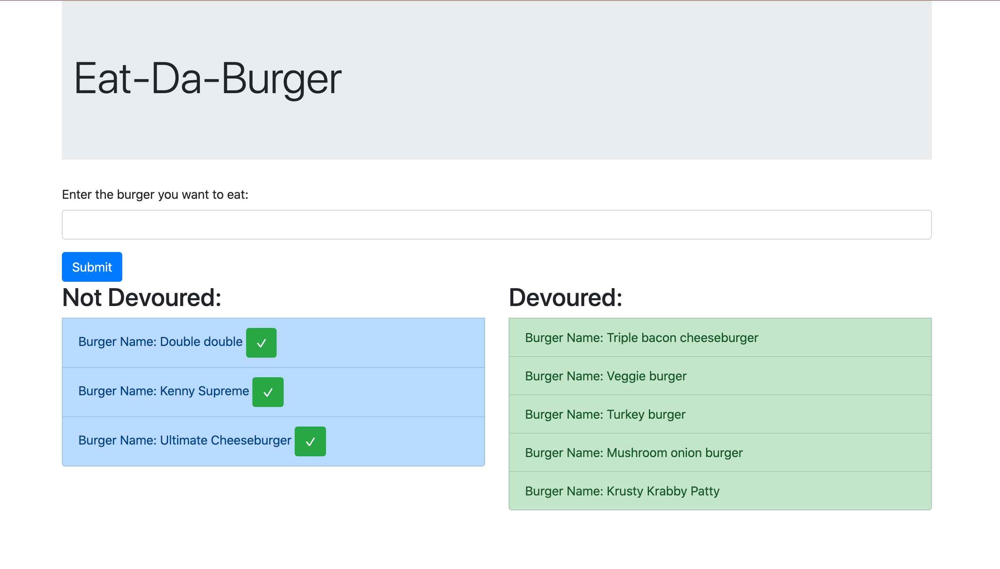

# burger

Link to deployed App: https://floating-plains-55582.herokuapp.com/

## Description:
> This is the Eat-Da-Burger application!  This simple app uses an express server,a mySQL database, and handlesbars to render front end.  We allow the user to input a burger they wish to eat.  Then we can see the list of devoured and not devoured burgers.

### Usage: 
To use this application, enter in the name of the burger that you wish to eat.  Click submit and the burger will populate into the "Not Devoured" list.  All the not devoured burgers can be devoured!  To devour, click the check box, and then the burger will populate in the devoured list.

### Screenshot of the app:

